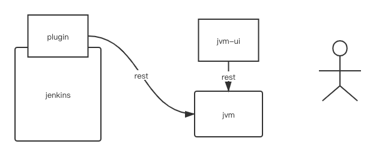

# Environment

------

|       | version |
| ----- | ------- |
| jdk   | 1.8     |
| node  | v8.10.0 |
| npm   | 5.6.0   |
| mongodb | 4.4     |
| maven | 3.6.3   |

------

# Build

- jvm and plugin
----------------
```shell script
mvn clean install -Dmaven.test.skip=true
cd jvm/target
java -jar jvm*.jar
```
---------------
- jvm-ui
```shell script
cd jvm -ui
npm install
npm run dev
```

see plugin documentation [here](doc/plugin.md)

see jvm-ui documentation [here](doc/jvm-ui.md)