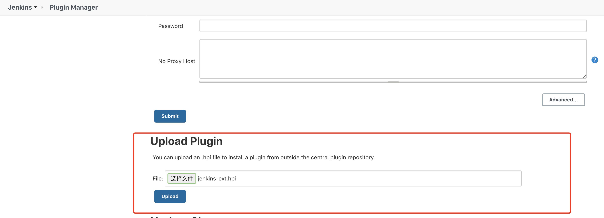
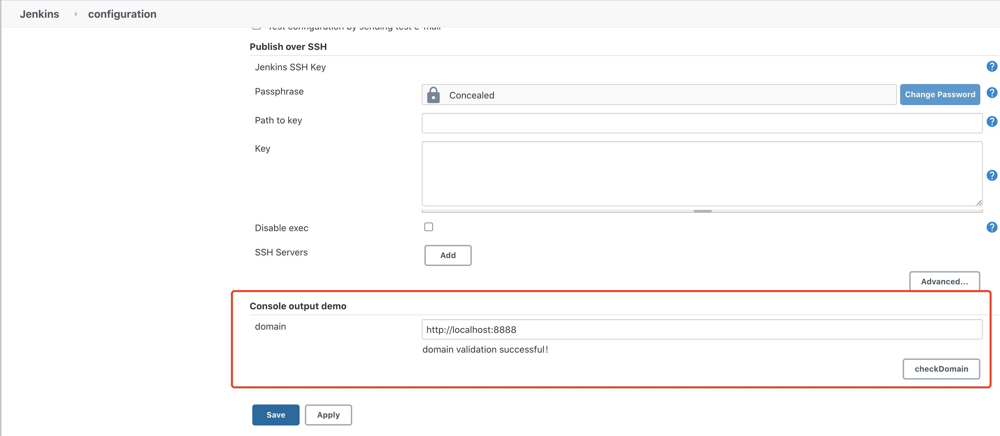

# Build

----

```shell script
mvn clean install -Dmaven.test.skip=true
```

# Upload Plugin

[Download](https://github.com/jlhuang9/jenkins-plugins/releases)
Upload the plugin（{profile}/plugin/target/jenkins-ext.hpi） to Jenkins(jenkins -> Manage -> Manage Plugins -> Advanced -> Upload Plugin)



restart jenkins

# Configure

Configure domain(jenkins -> Manage -> Configuration System -> Console output demo) and check

To checkDomain, you need to start the JVM service first!

